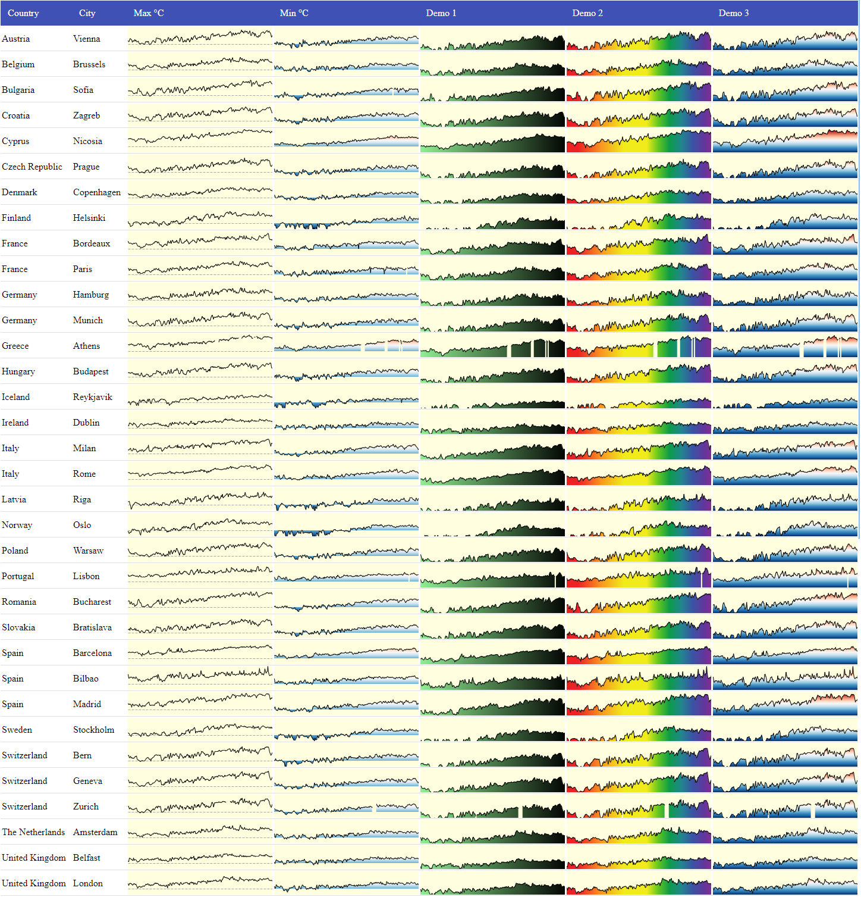
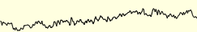
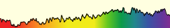
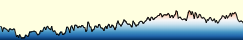
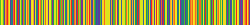
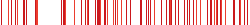
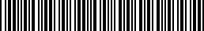

# sparklib - Small Charts, Big Impact

> **Note**: Documentation is very much work in progress and currently lacking in detail.

A lightweight library featuring a fluid API for easy creation of sparkline charts. Separate packages with components for [Angular](https://www.npmjs.com/package/ngx-sparklib) and [React](https://www.npmjs.com/package/react-sparklib) are available.

The library currently offers support for line charts, area charts, and stripe charts.

## What is a Sparkline Chart?

A sparkline is a minimalist, word-sized graphic that shows data trends with typographic clarity. In its most basic form, a sparkline lacks axes, labels, and gridlines, although **sparklib** offers basic support for these elements. Sparklines can be seamlessly embedded in text, tables, or headlines to provide a quick, contextual view of data variations.



## What Isn't a Sparkline Chart?

Sparklines are not suited for detailed data analysis requiring full support for axes, labels, legends, or gridlines. If you need these features or interactivity, consider using a full-fledged charting library like [Chart.js](https://www.chartjs.org/).

## Examples

### Line and Area Charts

<details>

<summary>Basic chart</summary>

```ts
const data: number[] = [16, 15.1, 10, 14.2 /* ... */];

// prettier-ignore
const chart = lineChart()
    .width(data.length)
    .height(40)
    .yDomain([0, 45])
    .background('lightyellow')
    .render(data);
```

</details>



<details>

<summary>Basic chart with a horizontal gradient</summary>

```ts
const data: number[] = [16, 15.1, 10, 14.2 /* ... */];

// prettier-ignore
const chart = lineChart()
  .width(data.length)
  .height(40)
  .yDomain([0, 45])
  .background('lightyellow')
  .fillStyle(
    // horizontal gradient
    linearGradient(0, 0, data.length, 0)
        .addColorStop(0, 'lightgreen')
        .addColorStop(1, 'black'))
  .render(data);
```

</details>




<details>

<summary>Basic chart with a vertical gradient</summary>

```ts
const data: number[] = [16, 15.1, 10, 14.2 /* ... */];
const height = 40;

// prettier-ignore
const chart = lineChart()
  .width(data.length)
  .height(height)
  .yDomain([0, 45])
  .background('lightyellow')
  .fillStyle(
    // vertical gradient
      linearGradient(0, 0, 0, height)
          .addColorStop(0.0, '#67001f')
          .addColorStop(0.1, '#b2182b')
          // ... more color stops
          .addColorStop(0.9, '#2166ac')
          .addColorStop(1.0, '#053061'))
  .render(data);
```

</details>



Gaps in your data series are handled gracefully.


### Stripe Charts

Stripe charts visualize numerical data through vertical stripes, where the length or color intensity can represent values or frequencies. They are particularly effective for displaying dozens of time series in a single view. The examples below are somewhat contrieved but demonstrate what is possible.




<details>

<summary>Simple stripes using a white to red gradient</summary>

```ts
const data = [0, 4.5, 0, 0, 0, 0 /* ... */];

const gradient = ['white', 'red'];

// prettier-ignore
const chart = stripeChart()
        .width(data.length)
        .height(25)
        .gradientColors(gradient, gradient.length)
        .render(data);
```

</details>



You can even make barcodes with **sparklib**. Here's the text "SPARKLIB" in [Code 39](https://en.wikipedia.org/wiki/Code_39) barcode format.

<details>
<summary>Barcode</summary>

```ts
barcodeData = [1, 0, 0, 1, 0, 1, 1 /* ... SPARKLIB */];

const chart = stripeChart()
  .width(barcodeData.length * 2)
  .height(40)
  .render(barcodeData);
```

</details>



## Further Reading

The concept of miniaturized data visualization has historical antecedents, but the term 'sparkline' and its modern interpretation were formalized by Edward Tufte in his 2006 book, [Beautiful Evidence](https://www.edwardtufte.com/bboard/q-and-a-fetch-msg?msg_id=0001OR) in 2006.

Wikipedia also has an entry for [sparklines](https://en.wikipedia.org/wiki/Sparkline).
